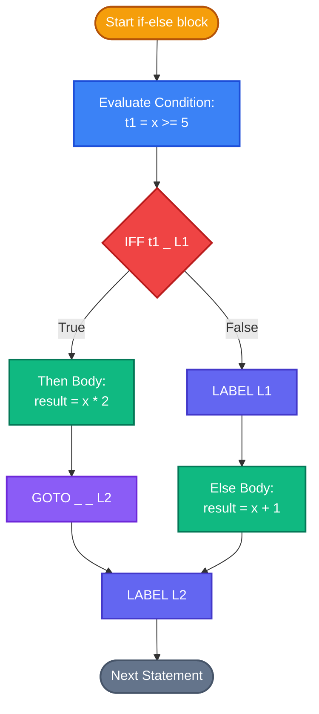
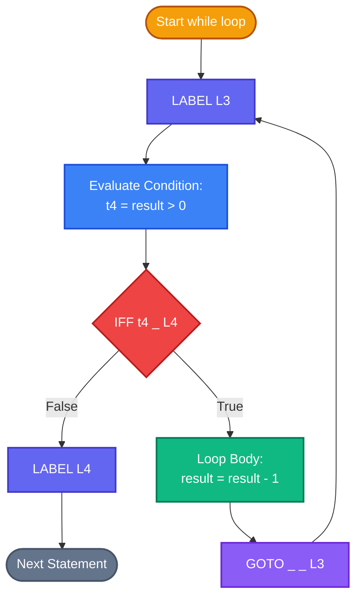
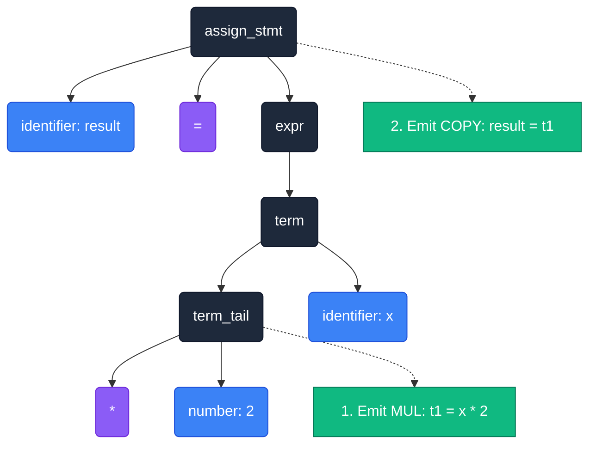

# ICG Diagrams

Here are the supplementary diagrams that explain the inner workings of our Intermediate Code Generator. Copy the code blocks below and paste them into Draw.io (by going to Arrange > Insert > Advanced > Mermaid) to generate the visual diagrams.

## 1. Compiler Pipeline Architecture
This diagram shows how the ICG fits into the overall compiler pipeline.

## 2. If/Else Statement ICG Translation
This flowchart illustrates the logic of how our `genIfStmt` function translates an If/Else statement into quadruples with jumps (`IFF` and `GOTO`).

## 3. While Loop ICG Translation
This flowchart demonstrates the quadruple layout generated for a `while` loop, particularly focusing on the return branch (`GOTO L_Start`) and conditional escape (`IFF`).

## 4. AST to Quadruple Transformation (result = x * 2)
This diagram details how a specific assignment expression is traversed bottom-up to emit quadruples correctly preserving precedence.

